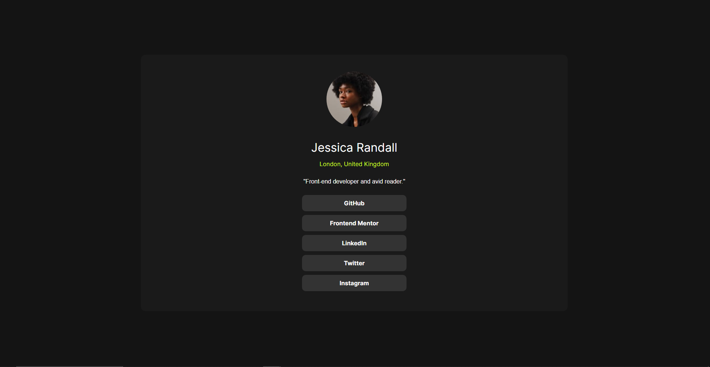

# Frontend Mentor - Perfil com Links Sociais

Esta é uma solução para o desafio [Perfil com Links Sociais no Frontend Mentor](https://www.frontendmentor.io/challenges/social-links-profile-UG32l9m6dQ). Os desafios do Frontend Mentor ajudam você a melhorar suas habilidades de codificação ao construir projetos realistas.

## Sumário

- [Visão Geral](#visão-geral)
  - [O Desafio](#o-desafio)
  - [Captura de Tela](#captura-de-tela)
  - [Links](#links)
- [Meu Processo](#meu-processo)
  - [Tecnologias Utilizadas](#tecnologias-utilizadas)
  - [Aprendizados](#aprendizados)
  - [Desenvolvimento Futuro](#desenvolvimento-futuro)
  - [Recursos Úteis](#recursos-úteis)
- [Autor](#autor)
- [Agradecimentos](#agradecimentos)

## Visão Geral

### O Desafio

Os usuários devem ser capazes de:

- Ver estados de hover e foco para todos os elementos na página.

### Captura de Tela

\`\`\`

\`\`\`

Adicione uma captura de tela da sua solução.

### Links

\`\`\`
- URL da Solução: [Adicione a URL da sua solução](https://your-solution-url.com)
- URL do Site Ao Vivo: [Adicione a URL do seu site ao vivo](https://your-live-site-url.com)
\`\`\`

## Meu Processo

### Tecnologias Utilizadas

\`\`\`
- HTML semântico
- Reset CSS
- Flexbox
- Google Fonts ([Inter](https://fonts.google.com/specimen/Inter))
- Abordagem mobile-first
\`\`\`

### Aprendizados

\`\`\`
Ao trabalhar neste projeto, aprendi a importância de:
- Utilizar HTML semântico para estruturar o conteúdo da página.
- Implementar um reset CSS para garantir uma aparência consistente entre diferentes navegadores.
- Integrar fontes do Google, neste caso, a fonte Inter.
- Criar uma abordagem mobile-first para garantir que o design seja responsivo em diferentes dispositivos.
\`\`\`

### Desenvolvimento Futuro

\`\`\`
Para futuros projetos, planejo:
- Aprofundar meus conhecimentos em CSS para criar animações e transições mais avançadas.
- Explorar frameworks CSS como Bootstrap ou Tailwind CSS para agilizar o processo de desenvolvimento.
- Aprender mais sobre JavaScript para tornar as interações na página mais dinâmicas e interativas.
\`\`\`

### Recursos Úteis

\`\`\`
- [Google Fonts - Inter](https://fonts.google.com/specimen/Inter) - Fonte utilizada no projeto.
- [Frontend Mentor](https://www.frontendmentor.io/challenges/social-links-profile-UG32l9m6dQ) - Desafio original que me ajudou a praticar minhas habilidades.
\`\`\`

## Autor

\`\`\`
- Frontend Mentor - [@luanbrendon](https://www.frontendmentor.io/profile/seuusername)
\`\`\`

## Agradecimentos

\`\`\`
Agradeço ao Frontend Mentor por fornecer desafios práticos que ajudam a melhorar minhas habilidades de codificação.
\`\`\`
